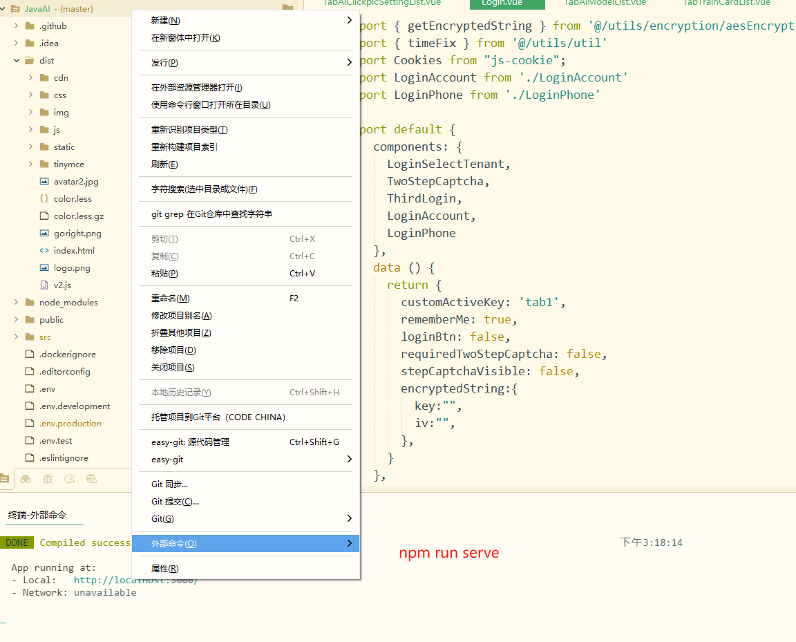
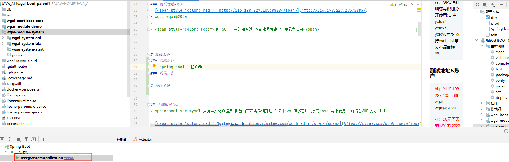

  

<h4 align="center">
<a href="README.md">中文文档</a> |<a href="README_EN.md">English Document</a> |
</h4>

**官网:  [http://120.48.51.195/#/](http://120.48.51.195/#/)**

## 🎡 介绍
> 简介：开箱即用的WebAI平台融合了AI图像识别opencv、yolo、OCR、人脸识别、语音识别内核识别;AI智能客服、AI语言模型、AI数字人可定制化自主离线化部署并自主化行业化使用
> 避免占用内存、GPU消耗训练与识别分开使用
> 
## 🔆为往胜继绝学！
> 
> 我正在参加 Gitee 2025 最受欢迎的开源软件投票活动，快来给我投票吧（投票可领取武功秘籍）
> 
>https://gitee.com/activity/2025opensource?ident=IAGE8
>
> 因为不设立商业版无收入来源,需要支撑服务器更新动力只有星球收入,所以教程都放在了星球内,知识星球中有问必答白天9-6（周一到周五) 
> 不卖课、不限制代码、星球完整教程只落地使用,实力强可自行阅读代码使用！如果对你有用可捐赠一杯咖啡！
> 

>
## 广告位合作
>   虚拟以待~ 合作联系~ 
> 
## 🔆他能做什么？
>1. ✅作为AI视频训练主机 -（训练自己的工业模型-下发模型到边缘视频AI分析盒子或直接平台使用）
>2. ✅作为边缘视频AI分析盒子-（32G内存CPU16核 16路实时分析亲测可用目前已多家再使用-含报警录像-报警图片-报警内容）
>3. ✅作为语音识别服务器、OCR识别服务器、chatGPT服务器、数字人服务器等
>4. ✅不需要额外开发无缝接入第三方平台、分开部署可一台服务器N台边缘盒子 
>5. ✅可自主离线化部署平台标注训练解放双手一件训练
>6. ✅无商业版本也不会开商业版本！为往胜继绝学
## ⁉️ 演示视频
> 内置ORC识别,图片识别,视频识别,训练模型,训练自己的数字人以前别人卡我们脖子当老大，现在我要自己当老大别人请求我！
>
> 演示视频0：[@平台整体功能介绍 ](https://www.bilibili.com/video/BV1Pcq5B6EJY/?spm_id_from=333.1387.homepage.video_card.click)
>
> 演示视频1：[@如何标注训练自己的识别模型 ](https://www.bilibili.com/video/BV13C9BYiEFS/?t=38.4)
>
> 演示视频2：[@训练完成如何使用](https://www.bilibili.com/video/BV1fJwhe7E1G/?spm_id_from=333.1387.homepage.video_card.click&vd_source=73d8a30a253a95bdb8b89a5fec80d9b9)
>
> 演示视频3：[@OCR在线识别与车牌识别](https://www.bilibili.com/video/BV1Dn2wBzEHg?spm_id_from=333.788.recommend_more_video.1&trackid=web_related_0.router-related-2206146-btjvp.1762476219409.71&vd_source=73d8a30a253a95bdb8b89a5fec80d9b9)
>
> 演示视频4：[@语音在线识别与配置](https://www.bilibili.com/video/BV1Dn2wBzENj?spm_id_from=333.788.recommend_more_video.-1&trackid=web_related_0.router-related-2206146-8k2m6.1762476197767.878&vd_source=73d8a30a253a95bdb8b89a5fec80d9b9)
>
> 演示视频5：[@矩形、多边形、控制点在线标注](https://www.bilibili.com/video/BV1hn2wB6EEN?spm_id_from=333.788.recommend_more_video.0&trackid=web_related_0.router-related-2206146-52fdn.1762476232980.626&vd_source=73d8a30a253a95bdb8b89a5fec80d9b9)
>
> 演示视频6：[@实时视频分析与预警推送](https://www.bilibili.com/video/BV1gn2wB6EQN/?spm_id_from=333.1387.homepage.video_card.click&vd_source=73d8a30a253a95bdb8b89a5fec80d9b9)
>
> 演示视频7：[@数字人结果视频/图片变成动态数字人视频/设置自己自己的文本与音色 ](https://img.nj-kj.com/zhangwei_1745562613859_1745465917540_1745567724504.mp4)
>
> 其他演示视频正在录制数字人训练、接入其他语言大模型等其他识别模型
>

## 🔆测试地址&账户
> [ http://1.95.152.91:9999/](http://1.95.152.91:9999/)
>
> wgai wgai@2024
> 
> 此项目倾注了我无数个深夜的调试与优化，它永远免费，但绝非无成本，如果您觉得这个工具 能为您节省时间、解决问题，甚至带来一丝愉悦，请考虑赞助一杯咖啡，让我知道：有人在乎这份付出，而这将成为我熬夜修复Bug、添加新功能的最大动力。开源不是用爱发电，您的认可会让它走得更远
>

> ## 👀 目前已支持功能
> ✅1.自主化离线化平台标注训练解放双手一件训练
> 
> ✅2.支持多方推理，GPU/NPU/CPU消耗
> 
> ✅3.直通第三方业务系统结合不融入项目独立部署API接口即可使用 学习研究使用直接上手无需学习其他内容
> 
> ✅4.ORC识别/语音识别/数字人/等全方面AI解决方案再也不被第三方卡脖子完整解决方案！
> 
> ✅5.支持多种chatGPT无缝接入作为服务器使用
> 
> ✅6. 其他细节功能自行查询.....持续更新....

# ⭐️ 如何直接上手？

## 💫 1.下载代码前后端
>springboot+vue+mysql 支持国产化数据库 配置内容不再详细赘述 如果java薄弱建议先学习java和vue再来使用
>
>[@gitee仓库地址 https://gitee.com/dromara/wgai](https://gitee.com/dromara/wgai)
>
>[@github仓库地址 https://github.com/dromara/wgai ](https://github.com/dromara/wgai)
>
>[@gitcode仓库地址 https://gitcode.com/dromara/wgai ](https://gitcode.com/dromara/wgai)
>
## 🏷️ 2. 启动前端
>  启动过程遇到什么问题可自行百度解决 前端在VUE分支！
>
>  第一步下载：npm  run install
>
>  第二步启动：npm  run serve
>
>  第三步打包前端（部署使用/开发不需要）：npm  run build
>
>  
>
## 🔖 2. 启动后端
> springboot单体直接运行 修改成你本地数据库连接和redis;
>
> 有很多朋友说找不到jar 有一些本地的jar我都放在目录下了需要手动导入到自己的maven库中（不会把jar导入到本地maven可以百度此处不做多余赘述）
>
>wgai-module-system\wgai-system-start\src\main\resources 目录下jar都需要
>
>wgai-module-system\wgai-system-biz\src\main\resources 目录下jar都需要
>
>  
>
## ❓ 3.其他问题
> 经过上述你还有问题那就isuess提问(随缘回复)/ 或者加入知识星球（有问必答）
>
> 

## WX注明来意不然不通过！！！！（有问题isuess提问或者星球提问） 

[//]: # ()

[//]: # ()

## 在线捐赠
### 如果此项目对你有用捐赠一下长期发展维护（捐赠>100前100名赠送AI秘籍）
 

### 捐赠名单按捐赠顺序前后鸣谢
@喜  |  @小白

# 新功能截图和功能介绍配置
### 在线训练&标注内容已经上线开源 支持windwos/linux 国产化服务器部署
#### 模型列表

#### 在线标注buq

#### 训练结果

#### 训练日志

### 新功能演示视频

>[@在线训练演示视频地址：https://www.bilibili.com/video/BV1EJwheEEYq/?vd_source=73d8a30a253a95bdb8b89a5fec80d9b9](https://www.bilibili.com/video/BV1EJwheEEYq/?vd_source=73d8a30a253a95bdb8b89a5fec80d9b9)

>[@在线识别演示视频地址：https://www.bilibili.com/video/BV1fJwhe7E1G/?vd_source=73d8a30a253a95bdb8b89a5fec80d9b9](https://www.bilibili.com/video/BV1fJwhe7E1G/?vd_source=73d8a30a253a95bdb8b89a5fec80d9b9)

## 语音音识别为本地化部署 并增加热词配置 支持windwos/linux 国产化服务器部署

## 目前支持语音识别鉴于我没有https 额外增加了一个静态音频识别的内容

## 目前支持 蓝牌、绿牌、黄牌、白牌、车辆车牌识别

## 目前支持 OCR 95%高精度文字提取识别

# 目前已经支持功能截图和功能介绍配置
## - 自主图片视频识别

###  首页       
>监管redis、jvm、服务器cpu 主要是cpu 尤为重要

###  模型库     
>自主添加训练好的模型,训练模型与识别是分开的,避免占用内存.

### 模型库绑定     
>支持图片上传、图片地址、视频地址、rtsp、rtmp、flv、fmp4、不支持静态mp4播放，但支持识别；因为播放器控件不允许静态文件播放

### 图片识别 
>支持第三方接口传递 识别耗时基本在1秒以内除特殊复杂问题之外 耗时单位目前为ms

###  视频识别 
>支持第三方接口传递 开启后一直识别不会中断 子线程cpu奔跑需要一定内存量 

### 第三方接入
>报警消息无缝接入接口对接无需集成 支持报警消息、图片、视频流接入

> 目前已支持的物品识别设置中文翻译以及边框颜色 （持续更新如果你们有特别想要模型的可以联系我1552138571@qq.com 或 qq:1552138571）

## - 自主智能聊天、ChatGpt
### chatGPT
> 支持exel、txt等文本语言模型；场景化特定训练 

## - 轻量级内核轻训练 

> 这个轻量级主要是使用的easyui内核  [@easyAi轻量级内核地址](https://gitee.com/dromara/easyAi) 他们有自己的内容训练内存消耗少训练时间短面对特定识别内容效率很高
> 由于时间有限暂未完全接入，有需要的同学可自主继续接入 

### 图片模型

### 训练结果

### 训练任务

## - 轻量级智能聊天

> 这个轻量级主要是使用的easyui内核  [@easyAi轻量级内核地址](https://gitee.com/dromara/easyAi) 他们有自己的内容训练内存消耗少训练时间短面对特定识别内容效率很高
> 由于时间有限暂未完全接入需要的同学可自主继续接入 
### 基础分类

### 语意分类

### 语句分类

### 关键词

### 智能的对话

### QA问答

### 语义模型训练

## 🛡️ License
[`Apache License, Version 2.0`](https://www.apache.org/licenses/LICENSE-2.0.html)

