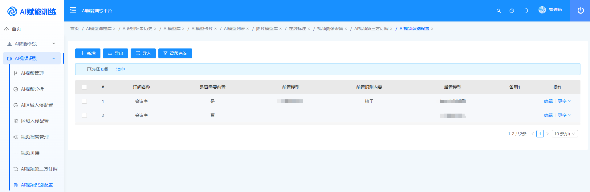
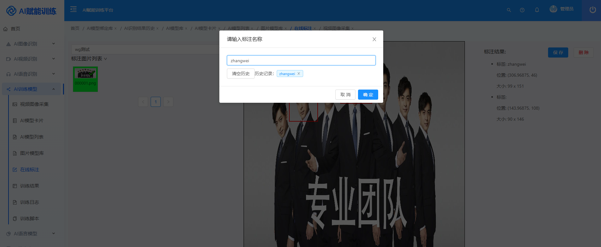
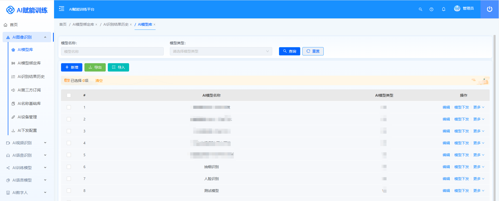
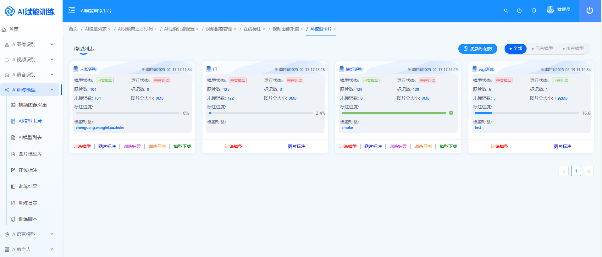
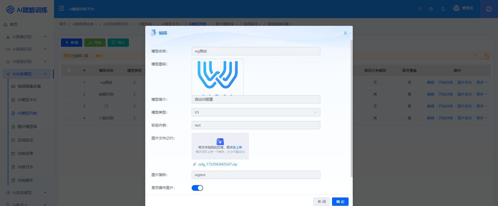

### 🔥 🔥 🔥  **WGAI训练识别平台V4.0重磅发布：一站式智能训练增加GPU-OPENCL-CPU 处理训练识别！**

> 🚫 郑重承诺：永久免费！不设商业版！ 只有知识星球！

>#### ✨**主要更新**
>*   ✅ 增加解码方式GPU/NPU/CPU 支持流媒体/摄像头直接接入
>*   ✅ 增加报警推送录像-增加视频订阅配置
>*   ✅ 增加标注记忆-快捷标注
>*   ✅ 更新前端新UI体
>***

>#### 📦 **下期预告**
>* 🚀 减少消耗增加迭代内容
>* 🚀 增加自动标注功能
>***

### 🖼️**效果展示**

>#### **1. 增加解码方式**
>
>*   **功能说明**：支持通过平台界面设置解码加速-解码方式GPU/NPU/CPU
>*   **技术优势**：
> *  适配国产化、英特尔、英伟达GPU加速，解码加速，识别加速

>#### **2. 增加一路视频多纬度模型识别**
>
>*   **功能说明**： 一条视频流支持多模型配置识别。
>*   **技术亮点**：
    *   可多模型判断后增加准确度 并增加模型直接联系
    *   例如：区域入侵-入侵人行为检测-入侵人员检测

>#### **3. 增加报警报警录像**
>
>
>*   **功能说明**：增加报警报警录像、录像推送、新ui内容
>*   **技术突破**：录像内也可存在分析结果
>* 

>#### **4. 新ui配色**
>
>
>
>
***

### **四、立即体验**

*   **开源地址Gitee**：<https://gitee.com/dromara/wgai>
*   **开源地址GitHub**：<https://github.com/dromara/wgai>
*   **体验地址**：<http://1.95.152.91:9999/>   密码：wgai wgai@2024
*   **演示视频**：<https://www.bilibili.com/video/BV13C9BYiEFS?t=38.4>
*   **加入社群**：

***
