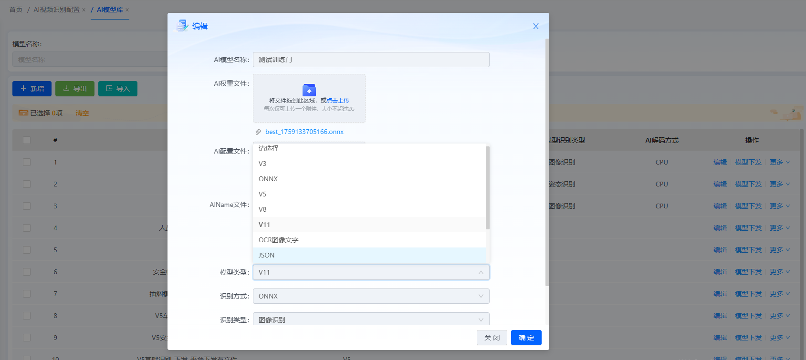
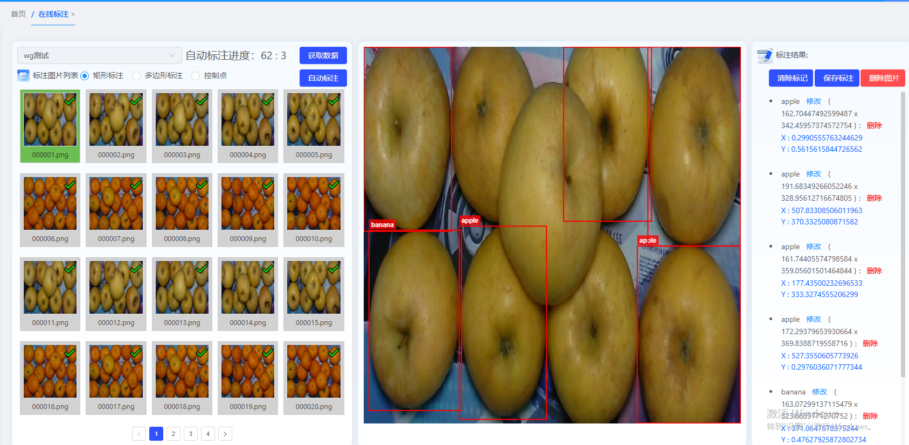
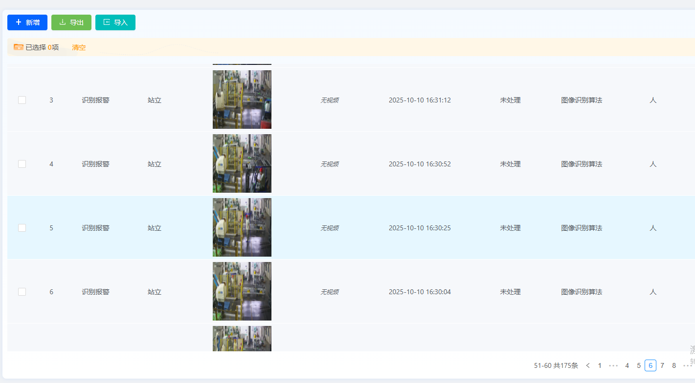
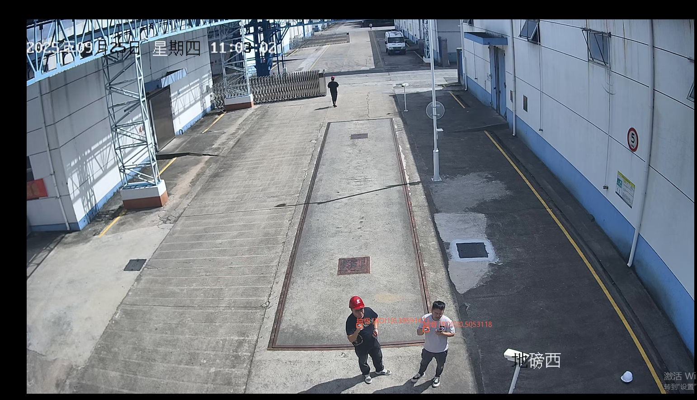
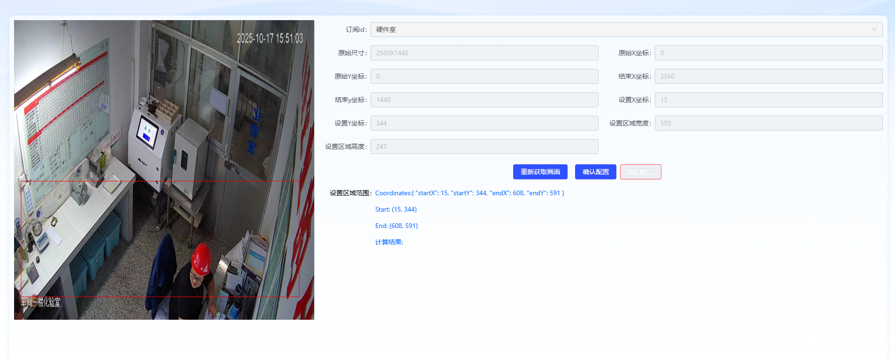

# 🔥🔥🔥 **WGAI训练识别平台 V5.0 重磅发布！**
### —— WGAI，让AI训练更简单、更自由；支持 YOLOv5 ~ YOLOv11 模型训练与识别，全面兼容 OpenCV DNN / ONNX CPU & GPU 加速！

> 💡 还在为模型版本兼容、识别、部署效率低而发愁？  
> 一站式 AI 训练与识别平台，再次突破！WGAI V5.0 来了，无论你是算法研究、AI创业、工业检测还是科研教学，都能快速上手，轻松部署！

> 🚫 **郑重承诺：永久免费！不设商业版！**  
> 平台仅限学习与研究用途，持续更新，仅在「知识星球」同步维护。

---

## ✨ **主要更新内容**

### ✅ 支持 YOLOv5 ~ YOLOv11 全系列模型训练与推理
- 一键切换版本，兼容主流结构与配置文件。
- 支持自定义数据集、超参与优化器配置。

📷 **示意图**：  

---

### ✅ 新增自动标注功能
- 结合视觉算法实现智能标注。
- 支持区域选取、动态标签生成，显著提升标注效率。

📷 **示意图**：  

---

### ✅ 新增人体姿态识别模块
- 可识别 17 / 25 / 33 个关键点骨架。
- 支持实时姿态分析、动作区域追踪。

📷 **示意图**：  

---

### ✅ 新增 ROI 区域切割识别
- 针对复杂场景可进行局部检测、识别优化。
- 提供模型级 ROI 管理与结果融合。

📷 **示意图**：  

---

### ✅ 新增“模区域绘制识别”功能
- 支持自定义识别区域绘制。
- 按模型级别可独立配置识别策略。

📷 **示意图**：  

---

## ⚙️ **兼容性与性能提升**

* 🚀 **支持 ONNX Runtime CPU / GPU 加速**
* ⚙️ **支持 OpenCV DNN 高速推理**
* 💾 **全面支持多模型并行调用、批量识别**
* 🔄 **模型版本智能检测与动态加载机制**

---

## 📦 **更多亮点**

* 可视化训练日志与精度曲线展示
* 一键导出推理模型（ONNX / pt / engine）
* 支持多线程视频流识别与图像批量检测
* 支持脚本式自动化训练任务配置

---
## 💬 开发者心声

* 以前调 YOLO 环境就要一天，现在几分钟就能跑起来
* 自动标注真的太香了，节省了我80%的时间。
* 姿态识别+ROI切割，科研项目简直神器级工具！
---
## 💬 **加入我们**

* 🧠 想了解更多模型训练技巧？  
* 📚 想获得专属识别案例与源码？
* 欢迎加入 **WGAI 知识星球**  
* 一起探索更高效、更智能的AI世界！
---
*   **开源地址Gitee**：<https://gitee.com/dromara/wgai>
*   **开源地址GitHub**：<https://github.com/dromara/wgai>
*   **体验地址**：<http://1.95.152.91:9999/>   密码：wgai wgai@2024
*   **演示视频**：<https://www.bilibili.com/video/BV13C9BYiEFS?t=38.4>
*   **加入社群**：
----
> 🔄 持续更新 · 专注本地化AI不被第三方卡脖子 · 永久开源
