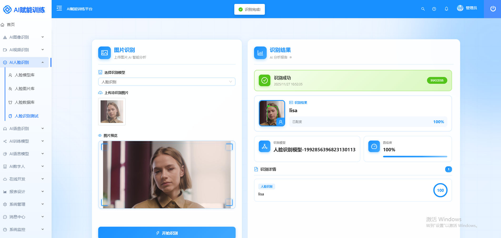
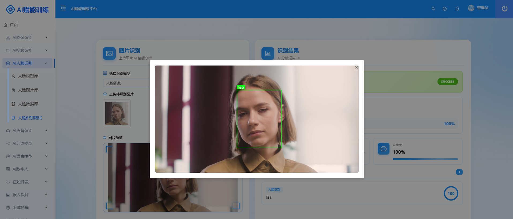
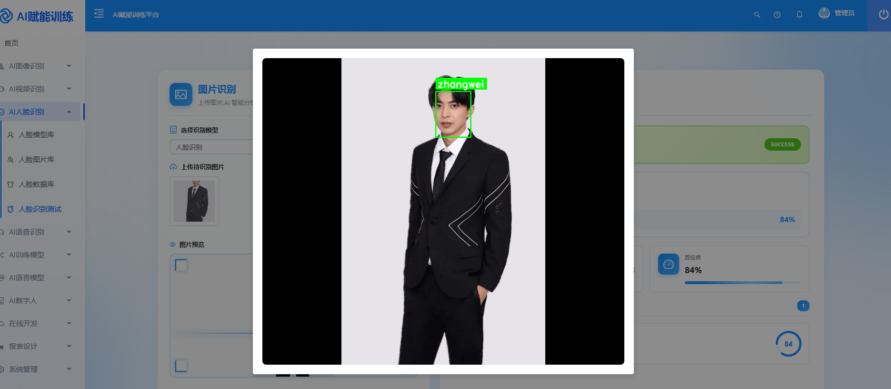
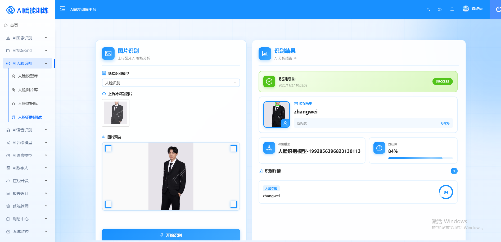
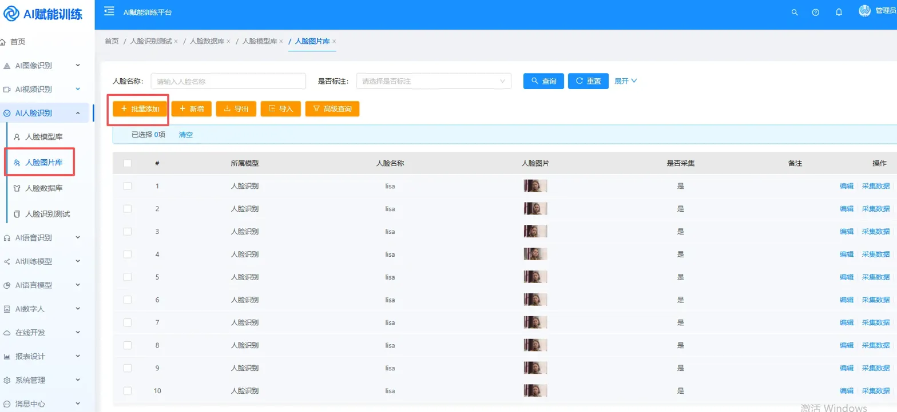

# 🎉 WGAI训练识别平台 V5.1 重磅发布!

## ✨ 新增人脸识别功能

### 核心亮点

- ⚡ **CPU识别毫秒级响应**
    - 极速识别,无需GPU加速
    - 识别速度可达毫秒级别

- 📸 **低样本量训练**
    - 只需10-20张人脸图片即可完成训练
    - 大幅降低数据采集成本

- 🎯 **一键采集人脸数据**
    - 简化数据采集流程
    - 支持批量导入管理

---

> 🚫 **郑重承诺:永久免费!不设商业版!**
>
> 平台仅限学习与研究用途,持续更新,仅在「知识星球」同步维护。

---

## 📷 功能截图

### 1. 人脸识别 - 图片上传与识别

*支持上传图片进行AI智能分析,实时显示识别结果和置信度*

### 2. 人脸检测 - 实时预览

*AI自动检测人脸区域,绿色框标注识别目标*

### 3. 多人脸识别

*支持单张图片中多个人脸的同时识别*

### 4. 识别结果展示

*详细显示识别结果、置信度评分、识别模型等信息*

### 5. 人脸图片库管理

*支持批量管理人脸数据,包含采集、编辑、导入导出等功能*

---

## 🔧 主要功能模块

---

## 📊 技术特性

- 高精度识别算法
- 轻量级部署方案
- 完整的管理后台
- 数据可视化分析
- 支持模型持续优化

---

## 🎓 适用场景

- AI学习与研究
- 人脸识别技术验证
- 算法效果测试
- 教学演示

---
## 💬 **加入我们**

* 🧠 想了解更多模型训练技巧？  
* 📚 想获得专属识别案例与源码？
* 欢迎加入 **WGAI 知识星球**  
* 一起探索更高效、更智能的AI世界！
---
*   **开源地址Gitee**：<https://gitee.com/dromara/wgai>
*   **开源地址GitHub**：<https://github.com/dromara/wgai>
*   **体验地址**：<http://1.95.152.91:9999/>   密码：wgai wgai@2024
*   **演示视频**：<https://www.bilibili.com/video/BV13C9BYiEFS?t=38.4>
*   **加入社群**：
----
> 🔄 持续更新 · 专注本地化AI不被第三方卡脖子 · 永久开源
