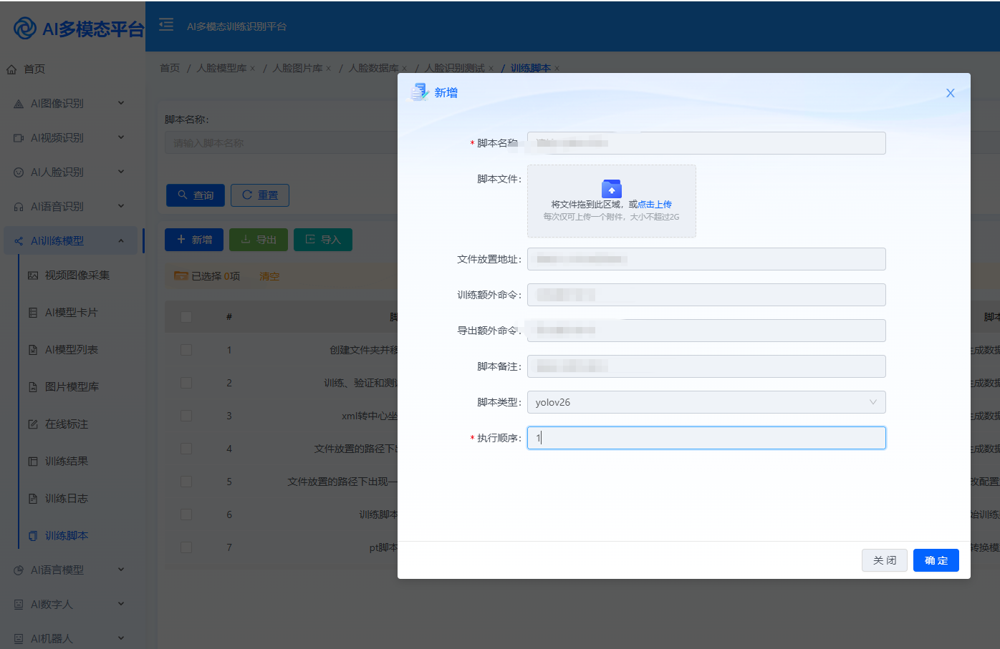
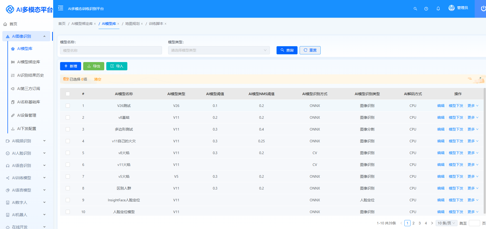
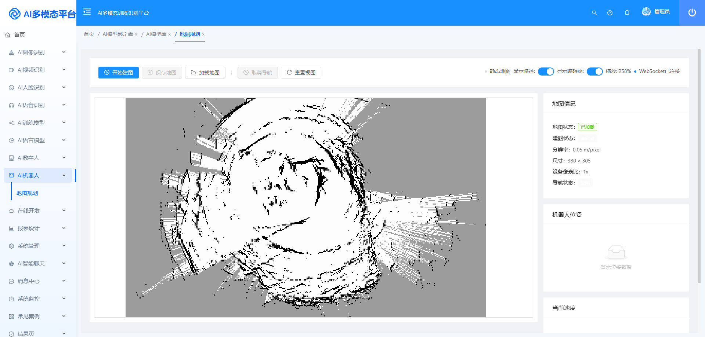
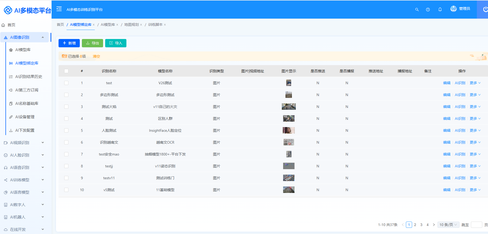

# 🚀 WGAI v5.2 发布：支持 YOLOv26 与 AGV 地图扫描能力升级

WGAI 迎来了新一轮版本升级。

本次版本 **WGAI v5.2** 主要围绕 **AI视觉能力升级与机器人巡检能力扩展**进行优化，让平台在 **模型训练、视觉识别、AGV巡检与部署能力**方面更加稳定和灵活。

本次升级重点包括：

- 支持 **YOLOv26**
- 完善 **YOLO 全系列模型兼容**
- 优化 **AI训练能力**
- 升级 **模型管理中心**
- 新增 **AGV地图扫描能力**
- 新增 **AGV路径规划能力**
- 优化 **视觉识别稳定性**

持续让 WGAI 成为 **更加易用、更加完整的AI视觉平台**。

---

# 🔥 核心升级一：支持 YOLOv26

在本次版本中，WGAI 已正式支持 **YOLOv26 模型识别能力**。

同时平台已经实现 **YOLO系列模型全面兼容**：

| 功能 | 支持范围 |
|---|---|
| 模型识别 | YOLOv3 - YOLOv26 |
| 模型训练 | YOLOv5 - YOLOv26 |
| 模型推理 | YOLOv3 - YOLOv26 |
| ONNX部署 | 支持 |
| GPU / CPU推理 | 支持 |

这意味着：

- 新版本模型可以直接接入
- 老版本模型仍然可以继续使用
- 不同版本模型可以统一管理

进一步提升平台 **模型兼容性与可持续升级能力**。

---

# ⚡ AI训练能力优化

本次版本对 **AI训练流程**进行了进一步优化。

在 WGAI 平台中，用户可以完成完整的 AI训练流程：

- 数据集管理
- 模型训练
- 训练日志查看
- 模型版本管理
- 模型导出部署

升级后：

- 训练任务稳定性提升
- 模型加载速度优化
- GPU训练更加稳定
- 训练日志更加清晰

让 AI模型训练 **更加简单高效**。

---

## 📷 训练界面

---

# 🧠 模型管理能力升级

为了更好地管理 AI模型，本次版本进一步优化了 **模型管理中心**。

支持：

- 模型上传
- 模型版本管理
- ONNX模型部署
- 模型推理调用
- 模型统一管理

开发者可以更加方便地对模型进行 **统一管理、部署与调用**。

---

## 📷 模型管理界面

---

# 🤖 AGV地图扫描与路径规划

在本次版本中，WGAI 新增 **AGV机器人地图扫描能力**。

平台可通过机器人设备进行 **环境地图构建（SLAM）**，并在系统中生成 **可视化地图**。

同时支持：

- AGV地图扫描
- 地图管理
- 路径规划
- 巡检路线配置

开发者可以在平台中 **快速配置巡检路线**，实现机器人巡检任务的基础能力。

这为后续 **AI视觉 + 机器人自动巡检** 打下基础。

---

## 📷 AGV地图扫描界面

---

# 🎯 AI视觉识别能力优化

WGAI 支持多种视觉识别方式：

- 图片识别
- 视频识别
- 实时监控识别
- GPU实时推理

通过统一平台即可快速部署 AI视觉能力。

本次版本进一步优化：

- 识别稳定性
- 推理效率
- 模型加载速度
- GPU推理性能

整体视觉识别能力得到进一步提升。

---

## 📷 AI识别界面

---

# 🏭 应用场景

WGAI 可以应用于多种 AI视觉场景，例如：

- 🏭 工业安全巡检
- 📦 智慧仓储
- 🏗 施工安全识别
- 🛡 视频监控识别
- 🤖 机器人巡检

帮助企业快速落地 **AI视觉与智能巡检应用**。

---

# 🚀 下一版本预告

下一版本 WGAI 将重点升级：

**AGV自动巡航 + AI视觉融合能力**

通过视觉系统与机器人结合，实现：

- AGV自主巡航
- AI视觉识别
- 自动路径规划
- 动态避障
- 自动巡检任务

未来可实现：

> 🚗 **机器人自动巡库、巡厂、巡检**

打造 **AI视觉 + 智能机器人巡检平台**。

---

# ⭐ 项目地址

WGAI 已在 **Gitee 与 GitHub 开源**，欢迎体验与参与。

---

## 💬 **加入我们**

* 🧠 想了解更多模型训练技巧？
* 📚 想获得专属识别案例与源码？
* 欢迎加入 **WGAI 知识星球**
* 一起探索更高效、更智能的 AI 世界！

---

* **开源地址 Gitee**  
  <https://gitee.com/dromara/wgai>

* **开源地址 GitHub**  
  <https://github.com/dromara/wgai>

* **开源地址 GitCode**  
  <https://gitcode.com/dromara/wgai>

* **体验地址**  
  <http://1.95.152.91:9999/>

账号：wgai  
密码：wgai@2024

* **演示视频**  
  <https://www.bilibili.com/video/BV13C9BYiEFS?t=38.4>

* **加入社群**  
  

---

> 🔄 持续更新 · 专注本地化AI · 不被第三方卡脖子 · 永久开源